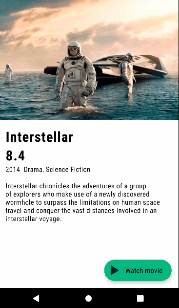
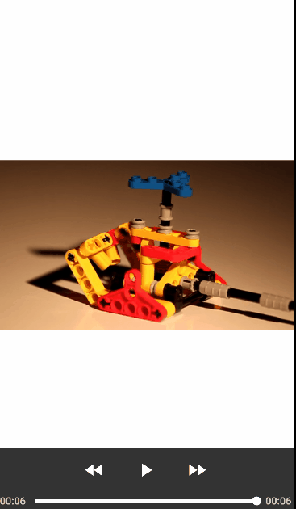

# CiOn
CiOn (means - Cinema Online) is an application that makes watching movies on Android easier.  
CiOn supports two themes - Light and Dark. You can toggle it in your smartphone settings.  

*Languages and tools used in this project:*
* _*Kotlin*_ as a main programming language
* _*Koin*_ as a Dependency Injection framework
* _*Retrofit*_ as an HTTP-client
* _*GSON*_ as a JSON to DTO converter
* _*Coroutines*_ for a multithreading
* _*Cicerone*_ as a screens' navigation
* _*Glide*_ for an image loading
* _*ExoPlayer*_ for a video player

## Screens
### Main Screen
On the Main Screen you will see some movies posters, which you can scroll horizontally. 
Tap on the poster will open Movie Card Screen.  

### Movie Card Screen
On the Movie Card Screen you will see detailed info about a film, such as genres, rate, overview  
and play button. 
Tap on the button will start Video Player.  

### Video Player Screen
On the Video Player Screen you will watch selected movie in full screen mode.  

## Demo
Below you can see a demo of CiOn application.  
